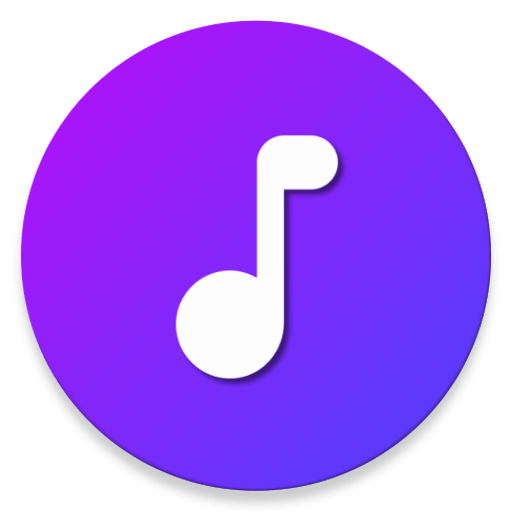
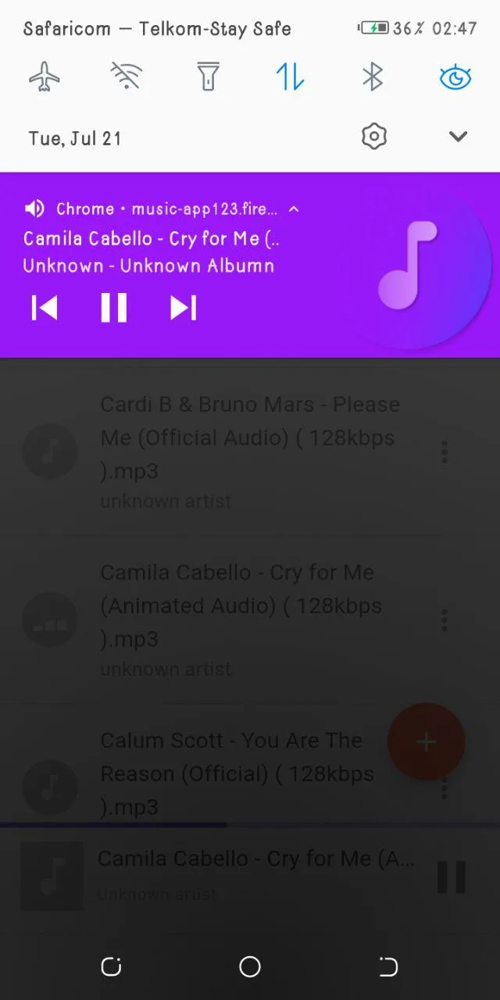
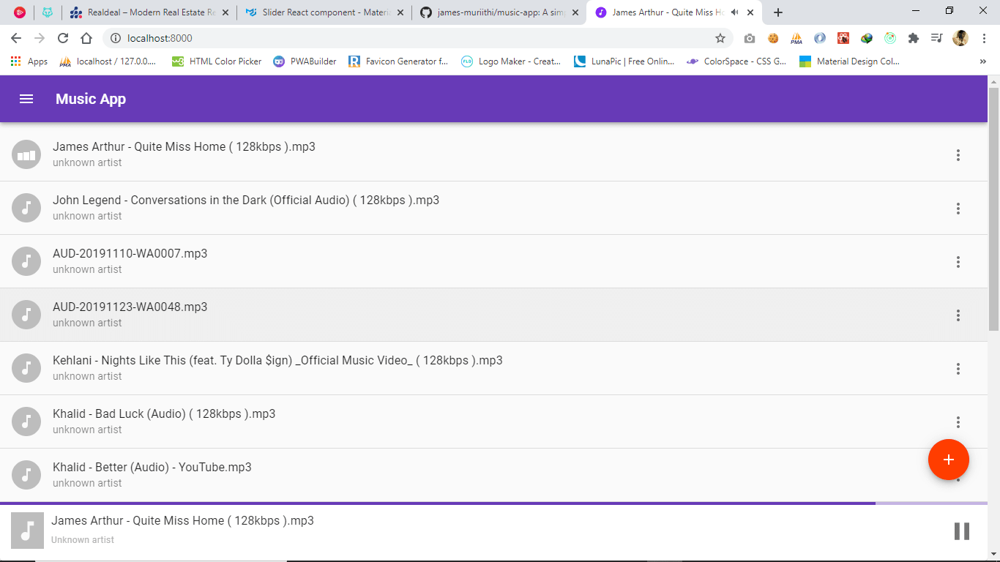
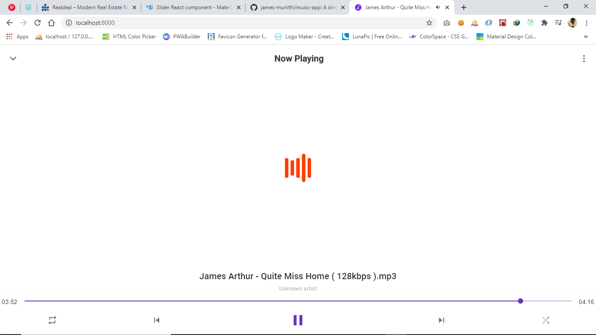

<!-- AUTO-GENERATED-CONTENT:START (STARTER) -->
<p align="center">
  <a href="https://music-app123.web.app/">
    
  </a>
</p>
<h1 align="center">
  Music App
</h1>

> A simple music player for local audio files built with gatsbyjs, redux, react


[](http://standardjs.com/)

[CHECK OUT THE DEMO](https://music-app123.firebaseapp.com/)

## Screenshots

<p align="center">



</p>

<p align="center">


</p>

## Quick start

> How to install

```
$ git clone https://github.com/james-muriithi/music-app.git
$ npm install
$ npm start
```

> Then in your browser go to [http://localhost:8000/](http://localhost:8000/)

### TECH STACK

- Gatsby
- Redux
- React

## Features

1. Play/Pause
1. Repeat Options
1. Progress Bar
1. Keyborad Controls

## TODO LIST

1. Play Next Automatically ✅
1. Controls - Next, Previous, Progress Bar ✅
1. Saving Songs(localStroage) ✅
1. A Page for currently playing song ✅
1. Repeat ✅
1. Seek progressbar on nowPlayingPage ✅
1. Let playing song show as playing ✅
1. Show Time ✅
1. Shuffle ✅
1. Favourite Songs ✅
1. Sont swipe left ✅
1. Favourites Page
1. Deploy to Firebase with travis-ci or github actions ✅
1. Search ✅
1. Playlists
1. Equalizer
1. Seek forward and backward

# Licence

[0BSD](LICENSE)
