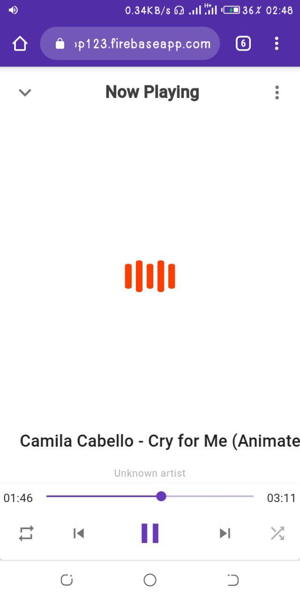
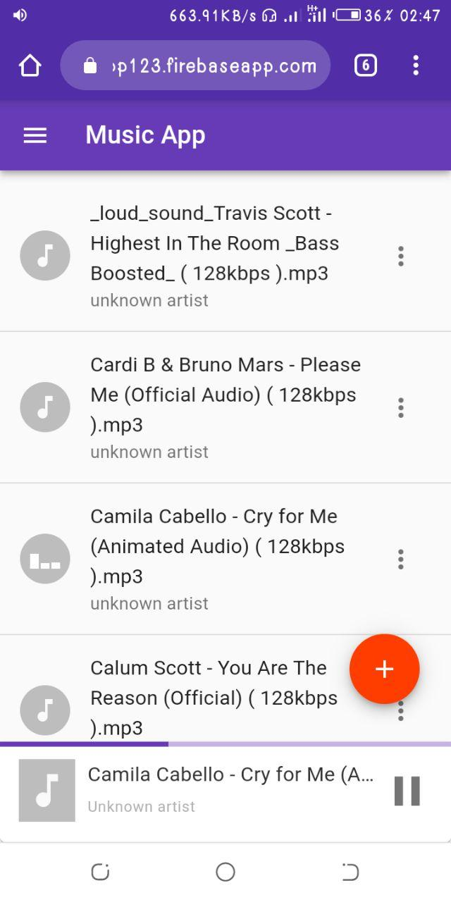
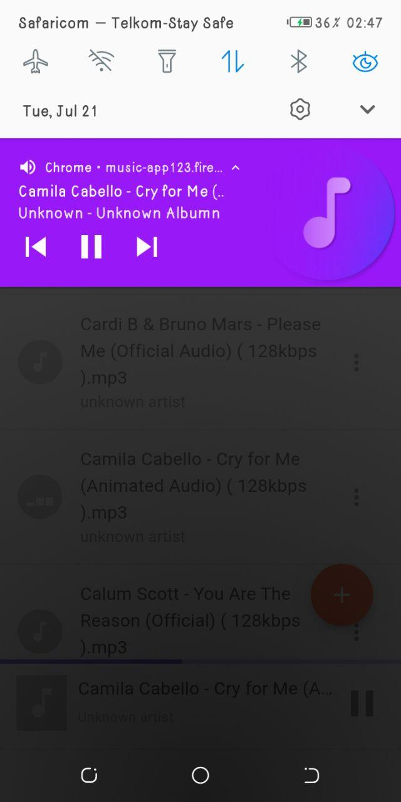
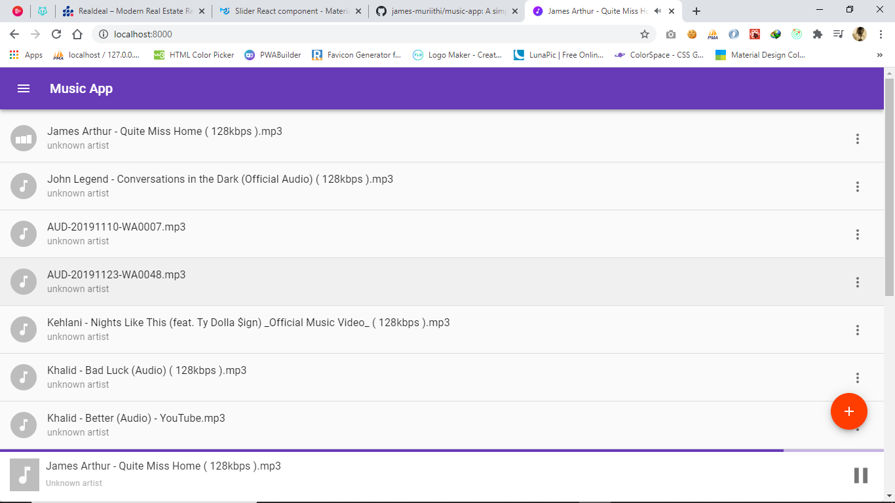

<!-- AUTO-GENERATED-CONTENT:START (STARTER) -->
<p align="center">
  <a href="https://music-app123.web.app/">
    
  </a>
</p>
<h1 align="center">
  Music App
</h1>

> A simple music player for local audio files built with gatsbyjs, redux, react

[](https://travis-ci.org/james-muriithi/music-app)
[](http://standardjs.com/)

## Screenshots
<p align="center">



</p>

<p align="center">


</p>

## Quick start
> How to install

```
$ git clone https://github.com/james-muriithi/music-app.git
$ npm install
$ npm start
```

> Then in your browser go to [http://localhost:8000/](http://localhost:8000/)


# Licence

[0BSD](LICENSE)